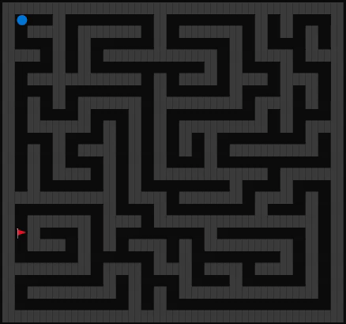
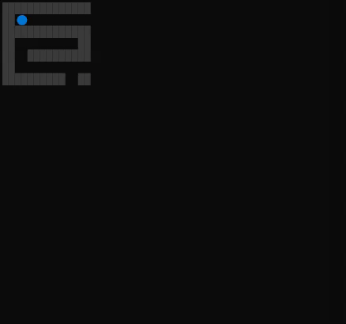

# REPLMaze.jl

A maze game in the Julia REPL.

<p align="center">
  
</p>

Mazes are randomly generated using a depth-first search (DFS). 

<p align="center">
  
</p>


## Partial observability

Press `p` to turn on partial observability (i.e., can only see through a 5x5 window).

* `-` to decrease the partially observable window
* `=` to increase the partially observable window
* `o` to reset the partially observable window

<p align="center">
  
</p>


## Installation
```julia
] add https://github.com/mossr/Maze.jl
```

## Gameplay
```julia
using REPLMaze
```
The game will start automatically.
- Hit `backtick` to pause the game.
- Resume with `play()`


## Controls (wasd)
* `a` and `d` to apply left and right velocity
* `s` to apply down velocity
* `w` to apply up velocity
* `backtick` to pause, then `play()` to resume
* `r` for a new map
* `p` to turn on _partial observablility_ (window)
* `-` to decrease the partially observable window
* `=` to increase the partially observable window
* `o` to reset the partially observable window


## Other options
- `play(w=25, h=25)`: Change the width and height of the generated maze.
- `play(po=true)`: Start the game in partially observable mode.


---
[Robert Moss](http://web.stanford.edu/~mossr)
